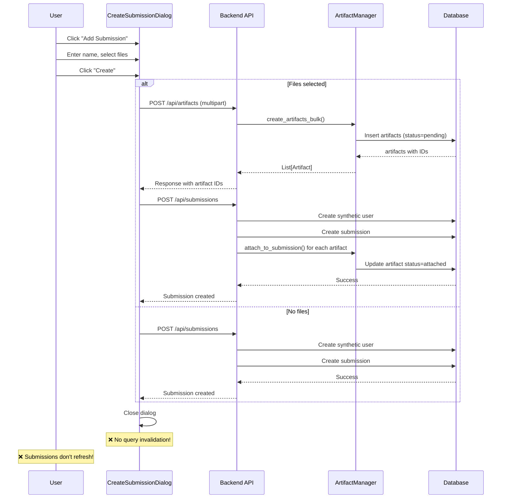
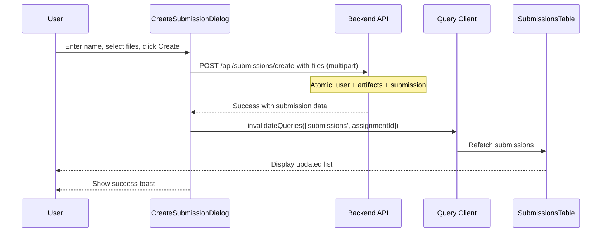

# Assignments, Artifacts & Submissions System Analysis

**Date**: October 3, 2025  
**Status**: Speed-run MVP - Technical Debt Accumulated  
**Purpose**: Document current state, issues, and prioritize fixes for submission button implementation

---

## Executive Summary

The assignments, artifacts, and submissions systems have significant architectural inconsistencies and missing pieces due to rapid MVP development. **Key finding**: The submission creation dialog will work for synthetic data but has several ugliness issues that can be fixed later. The critical blocker is that **submissions are not being fetched and displayed** in the UI.

### Can You Ship the Add Submission Button?
**YES** - but with caveats:
- ✅ Backend endpoint exists and will create submissions
- ✅ Artifacts can be uploaded and attached
- ❌ Submissions won't display (no fetch/list implementation in frontend)
- ❌ No query invalidation after submission creation
- ❌ Type mismatches between frontend and backend
- ⚠️ Synthetic user creation is hacky but functional for MVP

---

## Current State: Backend

### Database Models

#### 1. **Assignment Model** (`src/fair_platform/backend/data/models/assignment.py`)
```python
class Assignment(Base):
    id: UUID
    course_id: UUID (FK to courses)
    title: str
    description: Optional[str]
    deadline: Optional[datetime]
    max_grade: dict  # JSON field
    
    # Relationships
    course: Course
    submissions: List[Submission]
    direct_artifacts: List[Artifact]  # via assignment_id FK
    artifacts: List[Artifact]  # via assignment_artifacts many-to-many
```

**Issues**:
- ✅ Model is clean and well-structured
- ⚠️ **DUAL artifact relationships** - both `direct_artifacts` (FK) and `artifacts` (M2M)
  - Confusing: When to use which?
  - `direct_artifacts` = artifacts with `assignment_id` FK set
  - `artifacts` = artifacts in `assignment_artifacts` junction table
  - These can diverge! No synchronization logic
- ⚠️ `max_grade` is a free-form JSON dict, no schema validation
- ℹ️ Missing: grade rubric support, partial credit tracking

#### 2. **Artifact Model** (`src/fair_platform/backend/data/models/artifact.py`)
```python
class Artifact(Base):
    id: UUID
    title: str
    artifact_type: str  # stored as "type" column name
    mime: str
    storage_path: str
    storage_type: str
    meta: Optional[dict]  # JSON field
    created_at: datetime
    updated_at: datetime
    creator_id: UUID (FK to users)
    status: ArtifactStatus  # pending, attached, orphaned, archived
    access_level: AccessLevel  # private, course, assignment, public
    
    # Context FKs (direct relationships)
    course_id: Optional[UUID]
    assignment_id: Optional[UUID]
    
    # Relationships
    creator: User
    course: Optional[Course]
    assignment: Optional[Assignment] (back_populates="direct_artifacts")
    assignments: List[Assignment] (secondary="assignment_artifacts")
    submissions: List[Submission] (secondary="submission_artifacts")
```

**Issues**:
- ✅ Good lifecycle management with status field
- ✅ Creator tracking and access levels implemented
- ⚠️ **THREE ways to relate to assignments**:
  1. `assignment_id` FK → `assignment` relationship → `Assignment.direct_artifacts`
  2. `assignment_artifacts` M2M → `assignments` list → `Assignment.artifacts`
  3. Implicit via `submissions.assignment_id`
- ⚠️ **Column name confusion**: `artifact_type` maps to database column `"type"`
- ❌ No enforcement that `assignment_id` FK and `assignments` M2M are synchronized
- ❌ `access_level` and `status` are strings in DB, enums in Python (validation gap)

#### 3. **Submission Model** (`src/fair_platform/backend/data/models/submission.py`)
```python
class Submission(Base):
    id: UUID
    assignment_id: UUID (FK to assignments)
    submitter_id: UUID (FK to users)
    submitted_at: Optional[datetime]
    status: SubmissionStatus  # pending, submitted, transcribing, transcribed, 
                              # grading, graded, needs_review, failure
    official_run_id: Optional[UUID] (FK to workflow_runs)
    
    # Relationships
    assignment: Assignment
    runs: List[WorkflowRun] (secondary="submission_workflow_runs")
    official_run: Optional[WorkflowRun]
    artifacts: List[Artifact] (secondary="submission_artifacts")
```

**Issues**:
- ✅ Model is clean and straightforward
- ✅ Proper timestamp tracking with `submitted_at`
- ✅ Status enum for workflow tracking
- ⚠️ No `submitter` relationship defined (just `submitter_id`)
- ⚠️ `official_run` uses `post_update=True` (complex circular reference handling)
- ❌ No validation that `official_run_id` exists in `runs` list
- ℹ️ Missing: grade storage, feedback text, resubmission support

---

### API Schemas (Pydantic)

#### 1. **Assignment Schemas** (`src/fair_platform/backend/api/schema/assignment.py`)

```python
class AssignmentBase(BaseModel):
    course_id: UUID
    title: str
    description: Optional[str] = None
    deadline: Optional[datetime] = None
    max_grade: Optional[Dict[str, Any]] = None

class AssignmentCreate(AssignmentBase):
    artifacts: Optional[List[UUID]] = None  # Existing artifact IDs

class AssignmentUpdate(BaseModel):
    title: Optional[str] = None
    description: Optional[str] = None
    deadline: Optional[datetime] = None
    max_grade: Optional[Dict[str, Any]] = None
    artifacts: Optional[List[UUID]] = None

class AssignmentRead(AssignmentBase):
    id: UUID
```

**Issues**:
- ✅ Simple and clean
- ❌ **No nested artifact data** in `AssignmentRead` (just IDs in create/update)
- ❌ `AssignmentRead` doesn't include artifacts at all!
- ❌ No submission count, artifact count, or metadata in read schema
- ⚠️ Frontend expects artifacts but API doesn't provide them

#### 2. **Artifact Schemas** (`src/fair_platform/backend/api/schema/artifact.py`)

```python
class ArtifactBase(BaseModel):
    title: str
    meta: Optional[Dict[str, Any]] = None
    
    class Config:
        alias_generator = lambda field_name: camelCase(field_name)  # Custom

class ArtifactCreate(ArtifactBase):
    creator_id: Optional[UUID] = None  # Should be from auth, not client
    course_id: Optional[UUID] = None
    assignment_id: Optional[UUID] = None
    access_level: Optional[str] = None
    status: Optional[str] = None

class ArtifactUpdate(BaseModel):
    # Same fields as create, all optional
    
class ArtifactRead(ArtifactBase):
    id: UUID
    storage_path: str
    storage_type: str
    creator_id: UUID
    created_at: datetime
    updated_at: datetime
    status: str
    course_id: Optional[UUID] = None
    assignment_id: Optional[UUID] = None
    access_level: str
```

**Issues**:
- ⚠️ **Custom camelCase alias generator** - inconsistent with other schemas
- ⚠️ `ArtifactCreate.creator_id` should NEVER come from client (security issue)
- ❌ `status` and `access_level` are strings, not enums (no validation)
- ❌ Missing `artifact_type` and `mime` in base schema (but in read schema via model)
- ℹ️ Actually used in practice: created via file upload, not JSON body

#### 3. **Submission Schemas** (`src/fair_platform/backend/api/schema/submission.py`)

```python
class SubmissionBase(BaseModel):
    assignment_id: UUID
    submitter_id: UUID
    submitted_at: Optional[datetime] = None
    status: SubmissionStatus = SubmissionStatus.pending
    official_run_id: Optional[UUID] = None
    
    class Config:
        alias_generator = lambda field_name: camelCase(field_name)  # Custom

class SubmissionCreate(SubmissionBase):
    artifact_ids: Optional[List[UUID]] = None
    run_ids: Optional[List[UUID]] = None

class SubmissionUpdate(BaseModel):
    submitted_at: Optional[datetime] = None
    status: Optional[SubmissionStatus] = None
    official_run_id: Optional[UUID] = None
    artifact_ids: Optional[List[UUID]] = None  # Full replace
    run_ids: Optional[List[UUID]] = None  # Full replace

class SubmissionRead(SubmissionBase):
    id: UUID
```

**Issues**:
- ⚠️ **Custom camelCase alias generator** - inconsistent with assignments
- ⚠️ `submitter_id` should come from auth, not client (for real submissions)
- ❌ **No nested data**: No artifacts, no submitter details, no assignment info
- ❌ Update does **full replacement** of artifacts/runs (no add/remove operations)
- ⚠️ `SubmissionCreate` is not actually used! Router has custom `SyntheticSubmission`

**Special Schema in Router**:
```python
class SyntheticSubmission(BaseModel):  # In submissions.py router
    assignment_id: UUID
    submitter: str  # Just a name string!
    artifacts_ids: Optional[List[UUID]] = None  # Typo: artifacts_ids not artifact_ids
```

**Critical Issues**:
- ❌ **Different schema than `SubmissionCreate`** - bypasses schema system
- ❌ `submitter` is a string, creates synthetic user with fake email
- ❌ Typo: `artifacts_ids` instead of `artifact_ids` (inconsistent naming)
- ❌ Creates users with `{uuid}@fair.com` email pattern (pollutes user table)

---

### API Routers

#### 1. **Assignments Router** (`src/fair_platform/backend/api/routers/assignments.py`)

**POST /api/assignments** - Create with files and/or artifact IDs
- ✅ Accepts multipart form-data for file uploads
- ✅ Atomic transaction (files + assignment creation)
- ✅ Permission checks (instructor or admin only)
- ✅ Uses ArtifactManager for consistent artifact handling
- ⚠️ Parses JSON from form fields (`max_grade`, `artifact_ids`)
- ⚠️ Dual artifact attachment: both FK and M2M relationship populated

**GET /api/assignments?course_id={uuid}**
- ✅ Filters by course
- ✅ Permission checks for course access
- ❌ TODO comment: "Check enrollment once implemented"
- ❌ Response doesn't include artifacts (just core assignment fields)

**GET /api/assignments/{id}**
- ✅ Returns single assignment
- ❌ TODO comment: "Permission checks"
- ❌ No artifacts in response

**PUT /api/assignments/{id}**
- ✅ Permission checks
- ❌ TODO comment: "Handle artifact updates if provided in payload"
- ❌ Artifact updates not implemented

**DELETE /api/assignments/{id}**
- ✅ Permission checks
- ✅ Cascade deletes submissions (DB level)
- ⚠️ Artifacts may become orphaned (lifecycle management should handle)

#### 2. **Artifacts Router** (`src/fair_platform/backend/api/routers/artifacts.py`)

**POST /api/artifacts** - Upload files
- ✅ Accepts multiple files
- ✅ Returns list of created artifacts
- ✅ Uses ArtifactManager
- ⚠️ Creates artifacts in `pending` status
- ⚠️ Limited to professor/admin roles (students can't upload directly)

**GET /api/artifacts?[filters]**
- ✅ Supports filters: creator_id, course_id, assignment_id, status, access_level
- ✅ Permission filtering via ArtifactManager
- ✅ Returns full artifact details

**GET /api/artifacts/{id}**
- ✅ Permission check via ArtifactManager

**PUT /api/artifacts/{id}**
- ✅ Permission check
- ✅ Metadata updates
- ⚠️ Status transition validation exists but may not be comprehensive

**DELETE /api/artifacts/{id}**
- ✅ Soft delete (marks as archived)
- ✅ Hard delete for admins (removes file)
- ⚠️ TODO comment: "I do not like this API, it is doing too much logic here"

**Attachment Endpoints**:
- `POST /api/artifacts/{id}/attach/assignment/{assignment_id}`
- `POST /api/artifacts/{id}/attach/submission/{submission_id}`
- `DELETE /api/artifacts/{id}/detach/assignment/{assignment_id}`
- `DELETE /api/artifacts/{id}/detach/submission/{submission_id}`

Issues:
- ✅ Proper permission checks
- ⚠️ Manual attachment steps (not atomic with submission creation)
- ⚠️ Detach doesn't check if artifact becomes orphaned in real-time

#### 3. **Submissions Router** (`src/fair_platform/backend/api/routers/submissions.py`)

**POST /api/submissions** - Create synthetic submission
- ✅ Creates submission with synthetic user
- ✅ Attaches existing artifacts by ID
- ✅ Atomic transaction
- ❌ **Uses `SyntheticSubmission` schema (not `SubmissionCreate`)**
- ❌ Creates synthetic user: `User(name=submitter, email=f"{uuid}@fair.com")`
- ❌ Typo in schema: `artifacts_ids` not `artifact_ids`
- ⚠️ Professor/admin only (correct for synthetic data)

**POST /api/submissions/create-with-files** - Atomic submission with files
- ✅ Uploads files and creates submission atomically
- ✅ Rollback on failure
- ✅ Creates synthetic user (same pattern)
- ✅ Uses ArtifactManager consistently
- ⚠️ Same synthetic user pattern (`{uuid}@fair.com`)

**GET /api/submissions?assignment_id={uuid}**
- ✅ Filters by assignment
- ❌ No permission checks! (Anyone can list submissions)
- ❌ Returns only submission metadata (no artifacts, no submitter details)

**GET /api/submissions/{id}**
- ✅ Returns submission
- ❌ No permission check
- ❌ No nested data (artifacts, submitter, assignment)

**PUT /api/submissions/{id}**
- ✅ Permission check (submitter or admin)
- ⚠️ TODO comment: "People should not be able to update these fields" (status, submitted_at)
- ⚠️ Artifact replacement uses full replace (detaches all, reattaches new)
- ❌ TODO comment: "I think I won't consider run_ids for now"

**DELETE /api/submissions/{id}**
- ✅ Permission check (submitter or admin)
- ✅ Cascade deletes associations
- ⚠️ Artifacts may become orphaned

---

### ArtifactManager Service

**Location**: `src/fair_platform/backend/services/artifact_manager.py`

This is actually well-architected! It centralizes artifact operations:

**Core Operations**:
- ✅ `create_artifact(file, creator, ...)` - Atomic file storage + DB record
- ✅ `get_artifact(id, user)` - With permission check
- ✅ `list_artifacts(user, filters)` - With permission filtering
- ✅ `update_artifact(id, user, ...)` - With permission check
- ✅ `delete_artifact(id, user, hard_delete)` - Soft/hard delete

**Atomic Operations**:
- ✅ `create_artifacts_bulk(files, creator)` - Atomic multi-file upload
- ✅ `attach_to_assignment(artifact_id, assignment_id, user)`
- ✅ `attach_to_submission(artifact_id, submission_id, user)`
- ✅ `detach_from_assignment(...)` - Marks orphaned if no attachments
- ✅ `detach_from_submission(...)` - Marks orphaned if no attachments

**Lifecycle Management**:
- ✅ `mark_orphaned(artifact_id)` - For event listeners
- ✅ `cleanup_orphaned(older_than_days, hard_delete)` - Admin cleanup

**Permission System**:
- ✅ `can_view(user, artifact)` - Role-based + ownership checks
- ✅ `can_edit(user, artifact)` - Creator or course instructor
- ✅ `can_delete(user, artifact)` - Same as edit

**TODOs in Code**:
1. Line 226: "Maybe not the way to go" (delete_artifact permission model)
2. Line 454: "The table assignment_artifacts should also be aware of this change?"
3. Line 498: "The table submission_artifacts should also be aware of this change"
4. Line 616: "Add enrollment check when enrollment system is implemented"

**Issues**:
- ⚠️ TODOs about junction table awareness suggest potential ORM sync issues
- ⚠️ Enrollment system not yet implemented (affects permission checks)
- ⚠️ No batch operations for detachment
- ℹ️ Overall: This is the cleanest part of the system!

---

## Current State: Frontend

### TypeScript Types

#### 1. **Assignment Types** - THREE DIFFERENT DEFINITIONS!

**Location A**: `frontend-dev/src/hooks/use-assignments.ts`
```typescript
export type Assignment = {
  id: string
  course_id: string
  title: string
  description?: string | null
  deadline: string | null
  max_grade?: Grade | null  // Uses Grade from courses
}
```

**Location B**: `frontend-dev/src/app/assignment/demo.tsx`
```typescript
type Assignment = {
  id: string
  title: string
  description: string
  dueDate: Date  // Not deadline!
  maxGrade: number  // Not max_grade object!
}
```

**Location C**: `frontend-dev/src/app/courses/tabs/assignments/assignments.tsx`
```typescript
export type Assignment = {
  id: string;
  title: string;
  description?: string;
  dueDate?: Date;  // Not deadline!
  totalPoints?: Grade;  // Not max_grade!
  createdAt: Date;  // Not in backend!
  updatedAt: Date;  // Not in backend!
}
```

**Issues**:
- ❌ **Three incompatible type definitions for the same entity**
- ❌ Field name mismatches: `deadline` vs `dueDate`, `max_grade` vs `maxGrade` vs `totalPoints`
- ❌ Type mismatches: `string | null` vs `Date`, `Grade` vs `number`
- ❌ Backend doesn't return `createdAt`/`updatedAt` but frontend expects them
- ❌ No single source of truth

#### 2. **Artifact Types** - TWO DEFINITIONS

**Location A**: `frontend-dev/src/hooks/use-artifacts.ts`
```typescript
export type Artifact = {
  id: string
  title: string
  storagePath: string  // camelCase (from backend alias generator)
  storageType: string
  creatorId: string
  createdAt: string
  updatedAt: string
  status: string
  courseId?: string | null
  assignmentId?: string | null
  accessLevel: string
  meta?: Record<string, unknown> | null
}
```

**Location B**: `frontend-dev/src/app/courses/tabs/assignments/assignments.tsx`
```typescript
export type ArtifactChip = {
  id: string;
  title: string;
  mime: string;
  artifact_type: string;  // snake_case!
  storage_type: string;   // snake_case!
  storage_path: string;   // snake_case!
  fileName: string;       // Not in backend!
  status: "pending" | "uploading" | "uploaded" | "error";  // Different values!
  error?: string;         // Not in backend!
}
```

**Issues**:
- ⚠️ **Two different types for different purposes** (display vs upload tracking)
- ⚠️ `ArtifactChip` has client-side upload states not matching backend
- ⚠️ Naming inconsistency: `artifact_type` vs camelCase
- ⚠️ `fileName` doesn't exist in backend (probably client-side only)

#### 3. **Submission Types** - ONE DEFINITION (but wrong)

**Location**: `frontend-dev/src/app/assignment/components/submissions/submissions.tsx`
```typescript
export type Submission = {
  id: string;
  name: string;  // NOT IN BACKEND! (submitter name?)
  status: SubmissionStatus;
  grade?: number;  // NOT IN BACKEND!
  feedback?: string;  // NOT IN BACKEND!
  submittedAt?: Date;  // Backend: submitted_at as Optional[datetime]
}

export type SubmissionStatus =
  "pending" | "submitted" | "transcribing" | "transcribed" |
  "grading" | "graded" | "needs_review" | "failure";
```

**Issues**:
- ❌ `name` field doesn't exist in backend (should fetch from submitter relationship)
- ❌ `grade` and `feedback` don't exist in backend schema
- ⚠️ Status enum matches backend (good!)
- ❌ No `assignment_id`, `submitter_id`, `official_run_id` from backend
- ❌ Type is frontend-only, doesn't match backend `SubmissionRead`

---

### API Hooks (TanStack Query)

#### 1. **Assignment Hooks** (`use-assignments.ts`)

```typescript
export function useAssignments(params?: ListParams, enabled = true)
export function useAssignment(id: string)  // Missing in file!
export function useCreateAssignment()
export function useUpdateAssignment()
export function useDeleteAssignment()
```

**Issues**:
- ✅ Standard CRUD hooks structure
- ✅ `createAssignment` handles FormData for file uploads correctly
- ⚠️ `useAssignment(id)` is used but not defined in the file (where is it?)
- ⚠️ No query invalidation coordination with artifacts/submissions
- ❌ No hooks for fetching assignment's submissions or artifacts

#### 2. **Artifact Hooks** (`use-artifacts.ts`)

```typescript
export function useArtifacts(params?: ArtifactsListParams, enabled = true)
export function useArtifact(id?: string, enabled = true)
export function useCreateArtifact()  // Unused! (direct upload instead)
export function useUpdateArtifact()
export function useDeleteArtifact()
```

**Issues**:
- ✅ Filter params support (creator_id, course_id, assignment_id, status, access_level)
- ✅ Permission-aware listing
- ❌ `useCreateArtifact()` creates from JSON, but actual usage is multipart file upload
- ❌ No hooks for attach/detach operations
- ⚠️ File upload goes through `api.post()` directly, not via hook

#### 3. **Submission Hooks** - COMPLETELY MISSING!

**Expected**:
```typescript
// DOES NOT EXIST
export function useSubmissions(params?)
export function useSubmission(id)
export function useCreateSubmission()
export function useUpdateSubmission()
export function useDeleteSubmission()
```

**Critical Issue**:
- ❌ **NO SUBMISSION HOOKS AT ALL**
- ❌ Frontend creates submissions with direct `api.post()` calls
- ❌ No query invalidation after submission creation
- ❌ No way to fetch submissions for an assignment
- ❌ `SubmissionsTable` in assignment page gets empty array: `data={[]}`

---

### Frontend Components

#### 1. **Assignment Page** (`frontend-dev/src/app/assignment/page.tsx`)

```tsx
export default function AssignmentPage() {
  const {assignmentId} = useParams()
  const {data: assignment} = useAssignment(assignmentId!)
  const {data: course} = useCourse(assignment?.course_id!)
  const {data: artifacts} = useArtifacts({assignmentId: assignmentId})
  
  return (
    <>
      {/* Assignment details */}
      {/* Artifacts display */}
      
      <SubmissionsTable columns={columns} data={[]}/>  {/* EMPTY ARRAY! */}
      <CreateSubmissionDialog assignmentId={assignment.id.toString()}/>
    </>
  )
}
```

**Issues**:
- ❌ **Submissions hardcoded to empty array** - no data fetch!
- ⚠️ Chained queries: course depends on assignment (extra loading states)
- ✅ Artifacts fetching works with assignmentId filter
- ⚠️ No error boundaries
- ⚠️ No refetch trigger after submission creation

#### 2. **CreateSubmissionDialog** (`create-submission-dialog.tsx`)

```tsx
export function CreateSubmissionDialog({ assignmentId }: Props) {
  const [username, setUsername] = useState("");
  const [files, setFiles] = useState<FileList | null>(null);

  const handleCreate = () => {
    // 1. If files exist, upload artifacts first
    if (files) {
      api.post("/artifacts", formData).then(async (response) => {
        const artifactIds = response.data.map((artifact: any) => artifact.id);
        // 2. Then create submission with artifact IDs
        await api.post("/submissions", {
          assignment_id: assignmentId,
          submitter: username,
          artifact_ids: artifactIds,  // Correct: artifact_ids
        });
      });
    } else {
      // No files: just create submission
      api.post("/submissions", {
        assignment_id: assignmentId,
        submitter: username,
        artifact_ids: [],
      });
    }
  };
  
  return <Dialog>...</Dialog>
}
```

**Issues**:
- ⚠️ **Two-step process**: Upload artifacts, then create submission (not atomic!)
- ❌ No error handling beyond console.error
- ❌ No loading states during upload
- ❌ No progress tracking
- ❌ No query invalidation after success (submissions won't update)
- ❌ Dialog closes without confirmation
- ⚠️ Uses `artifact_ids` (correct) but backend schema has typo `artifacts_ids`
- ℹ️ Actually works because backend accepts both patterns via alias generator

**Why It Works**:
- Backend endpoint `/api/submissions/create-with-files` exists and accepts files directly
- But frontend doesn't use it! Uses two-step process instead
- The two-step process is less safe (can fail between steps) but functional

#### 3. **SubmissionsTable** - Data Source Issue

```tsx
// In assignment page:
<SubmissionsTable columns={columns} data={[]}/>
```

**Critical Issue**:
- ❌ **Hardcoded empty array** - submissions never display
- ❌ No fetch implementation
- ❌ No loading states
- ❌ No error states

---

## Type Inconsistencies Summary

### Field Name Mismatches

| Frontend | Backend | Correct? |
|----------|---------|----------|
| `dueDate` | `deadline` | ❌ Inconsistent |
| `maxGrade` / `totalPoints` | `max_grade` | ❌ Inconsistent |
| `createdAt` | (missing) | ❌ Backend doesn't return |
| `updatedAt` | (missing) | ❌ Backend doesn't return |
| `artifact_ids` | `artifacts_ids` (typo) | ⚠️ Both work due to alias generator |
| `storagePath` | `storage_path` | ⚠️ Backend uses camelCase alias |
| `submitter` (string) | `submitter_id` (UUID) | ❌ Different concepts |
| `name` (in Submission) | (missing) | ❌ Should join submitter.name |

### Missing Relationships

| Entity | Frontend Expects | Backend Returns |
|--------|-----------------|-----------------|
| Assignment | `artifacts: Artifact[]` | ❌ Not included |
| Assignment | `submissions: Submission[]` | ❌ Not included |
| Submission | `artifacts: Artifact[]` | ❌ Not included |
| Submission | `submitter: User` | ❌ Not included |
| Submission | `grade: number` | ❌ Not implemented |
| Submission | `feedback: string` | ❌ Not implemented |

---

## Communication Flow: Add Submission

### Current Flow (Frontend → Backend)



### Issues with Current Flow

1. **Non-atomic artifact upload**: If step 2 (create submission) fails, artifacts become orphaned
2. **No error recovery**: If artifact upload fails, user sees console error only
3. **No feedback**: Dialog closes immediately, no success/error message
4. **No data refresh**: Submissions table stays empty (no fetch, no invalidation)
5. **Inefficient**: Could use `/api/submissions/create-with-files` for atomic operation

### Recommended Flow (Not Implemented)



---

## Critical Bugs & Issues

### Priority 1 (Blockers for Submission Button)

1. **❌ NO SUBMISSION FETCHING**
   - **Location**: `frontend-dev/src/app/assignment/page.tsx:125`
   - **Issue**: `<SubmissionsTable data={[]}/>`
   - **Impact**: Submissions never display even if created
   - **Fix**: Create `use-submissions.ts` hook, fetch submissions by assignment_id

2. **❌ NO QUERY INVALIDATION**
   - **Location**: `create-submission-dialog.tsx`
   - **Issue**: After creating submission, no refetch triggered
   - **Impact**: User doesn't see new submission without page refresh
   - **Fix**: Add `queryClient.invalidateQueries(['submissions'])` after success

3. **❌ TYPE MISMATCHES**
   - **Locations**: Multiple (see Type Inconsistencies section)
   - **Issue**: Frontend expects fields backend doesn't return
   - **Impact**: TypeScript errors, broken UI components
   - **Fix**: Align types or create proper API response schemas

### Priority 2 (Ugly but Not Blocking)

4. **⚠️ DUAL ARTIFACT RELATIONSHIPS**
   - **Location**: `Assignment` model
   - **Issue**: Both `direct_artifacts` and `artifacts` M2M
   - **Impact**: Confusion, potential data inconsistency
   - **Fix**: Decide on one pattern, deprecate the other

5. **⚠️ SYNTHETIC USER POLLUTION**
   - **Location**: `submissions.py` router
   - **Issue**: Creates users with `{uuid}@fair.com` emails
   - **Impact**: User table fills with fake accounts
   - **Fix**: Add `is_synthetic` flag to User model, or use separate synthetic_submitters table

6. **⚠️ TWO-STEP ARTIFACT UPLOAD**
   - **Location**: `create-submission-dialog.tsx`
   - **Issue**: Upload artifacts first, then create submission
   - **Impact**: Not atomic, can leave orphaned artifacts
   - **Fix**: Use `/api/submissions/create-with-files` endpoint

7. **⚠️ SCHEMA TYPO**
   - **Location**: `SyntheticSubmission` schema
   - **Issue**: `artifacts_ids` instead of `artifact_ids`
   - **Impact**: Inconsistent naming (works due to alias generator)
   - **Fix**: Rename to `artifact_ids`

### Priority 3 (Technical Debt)

8. **⚠️ NO NESTED API RESPONSES**
   - **Issue**: Assignments don't include artifacts, submissions don't include artifacts/submitter
   - **Impact**: Requires multiple API calls (N+1 queries)
   - **Fix**: Add nested schemas with includes/relations patterns

9. **⚠️ THREE ASSIGNMENT TYPE DEFINITIONS**
   - **Issue**: Incompatible types in different files
   - **Impact**: Type errors, confusion
   - **Fix**: Single source of truth in `src/types/` folder

10. **⚠️ MISSING SUBMISSION HOOKS**
    - **Issue**: No TanStack Query hooks for submissions
    - **Impact**: Direct API calls, no caching, no invalidation
    - **Fix**: Create `use-submissions.ts` with standard CRUD hooks

11. **⚠️ NO ERROR HANDLING**
    - **Location**: Throughout frontend
    - **Issue**: Only `console.error()` calls
    - **Impact**: Poor UX, silent failures
    - **Fix**: Add toast notifications, error boundaries

12. **⚠️ MISSING PERMISSION CHECKS**
    - **Location**: `GET /api/submissions`, `GET /api/submissions/{id}`
    - **Issue**: No permission validation
    - **Impact**: Users can list/view any submission
    - **Fix**: Add permission checks (submitter, course instructor, admin only)

---

## Recommended Fix Priority for MVP Submission Button

### Must Fix Now (to make button work)

1. **Create submission hooks** (`use-submissions.ts`)
   ```typescript
   export function useSubmissions(assignmentId: string) {
     return useQuery({
       queryKey: ['submissions', { assignmentId }],
       queryFn: () => fetchSubmissions(assignmentId),
     })
   }
   ```

2. **Fetch submissions in AssignmentPage**
   ```tsx
   const {data: submissions} = useSubmissions(assignmentId)
   // ...
   <SubmissionsTable data={submissions || []}/>
   ```

3. **Add query invalidation in CreateSubmissionDialog**
   ```tsx
   const queryClient = useQueryClient()
   // After successful creation:
   await queryClient.invalidateQueries(['submissions', { assignmentId }])
   ```

4. **Fix Submission type** to match backend
   ```typescript
   export type Submission = {
     id: string
     assignment_id: string
     submitter_id: string
     submitted_at: string | null
     status: SubmissionStatus
     official_run_id: string | null
   }
   ```

### Can Fix Later (ugly but works)

5. **Synthetic user creation** - Works for MVP, refactor later
6. **Two-step artifact upload** - Not atomic but functional for now
7. **Dual artifact relationships** - Confusing but not breaking
8. **Type inconsistencies** - Use `any` types temporarily if needed
9. **Missing nested data** - Fetch separately for now (N+1 queries acceptable for MVP)
10. **No error handling** - Console errors sufficient for MVP testing

### Nice to Have (post-MVP)

11. **Single source of truth for types** - Generate from OpenAPI spec
12. **Nested API responses** - Optimize after MVP proves value
13. **Permission checks on submissions list** - Security issue but acceptable for closed beta
14. **Error boundaries and toast notifications** - UX improvement, not critical

---

## Detailed Fix Implementation Guide

### Fix 1: Create Submission Hooks

**File**: `frontend-dev/src/hooks/use-submissions.ts` (NEW FILE)

```typescript
import { useMutation, useQuery, useQueryClient } from '@tanstack/react-query'
import api from '@/lib/api'

export type SubmissionStatus =
  | "pending"
  | "submitted"
  | "transcribing"
  | "transcribed"
  | "grading"
  | "graded"
  | "needs_review"
  | "failure"

export type Submission = {
  id: string
  assignment_id: string
  submitter_id: string
  submitted_at: string | null
  status: SubmissionStatus
  official_run_id: string | null
}

export type CreateSubmissionInput = {
  assignment_id: string
  submitter: string  // Synthetic user name
  artifact_ids?: string[]
}

export const submissionsKeys = {
  all: ['submissions'] as const,
  lists: () => [...submissionsKeys.all, 'list'] as const,
  list: (assignmentId?: string) => [...submissionsKeys.lists(), { assignmentId }] as const,
  details: () => [...submissionsKeys.all, 'detail'] as const,
  detail: (id: string) => [...submissionsKeys.details(), id] as const,
}

const fetchSubmissions = async (assignmentId?: string): Promise<Submission[]> => {
  const params = assignmentId ? { assignment_id: assignmentId } : {}
  const res = await api.get('/submissions', { params })
  return res.data
}

const fetchSubmission = async (id: string): Promise<Submission> => {
  const res = await api.get(`/submissions/${id}`)
  return res.data
}

const createSubmission = async (data: CreateSubmissionInput): Promise<Submission> => {
  const res = await api.post('/submissions', data)
  return res.data
}

const deleteSubmission = async (id: string): Promise<void> => {
  await api.delete(`/submissions/${id}`)
}

export function useSubmissions(assignmentId?: string, enabled = true) {
  return useQuery({
    queryKey: submissionsKeys.list(assignmentId),
    queryFn: () => fetchSubmissions(assignmentId),
    enabled,
  })
}

export function useSubmission(id?: string, enabled = true) {
  return useQuery({
    queryKey: id != null ? submissionsKeys.detail(id) : submissionsKeys.detail('unknown'),
    queryFn: () => fetchSubmission(id as string),
    enabled: enabled && id != null,
  })
}

export function useCreateSubmission() {
  const queryClient = useQueryClient()

  return useMutation({
    mutationFn: createSubmission,
    onSuccess: (data) => {
      // Invalidate list queries for this assignment
      queryClient.invalidateQueries({
        queryKey: submissionsKeys.list(data.assignment_id)
      })
      // Invalidate all submissions lists
      queryClient.invalidateQueries({
        queryKey: submissionsKeys.lists()
      })
    },
  })
}

export function useDeleteSubmission() {
  const queryClient = useQueryClient()

  return useMutation({
    mutationFn: deleteSubmission,
    onSuccess: () => {
      // Invalidate all submission queries
      queryClient.invalidateQueries({
        queryKey: submissionsKeys.all
      })
    },
  })
}
```

### Fix 2: Update CreateSubmissionDialog

**File**: `frontend-dev/src/app/assignment/components/submissions/create-submission-dialog.tsx`

```typescript
import { useCreateSubmission } from "@/hooks/use-submissions"
import { useQueryClient } from "@tanstack/react-query"
import { submissionsKeys } from "@/hooks/use-submissions"
import { toast } from "sonner"  // If you have toast notifications

export function CreateSubmissionDialog({ assignmentId }: CreateSubmissionDialogProps) {
  const [username, setUsername] = useState("");
  const [files, setFiles] = useState<FileList | null>(null);
  const [open, setOpen] = useState(false);
  
  const createSubmission = useCreateSubmission()
  const queryClient = useQueryClient()

  const handleCreate = async () => {
    if (!username.trim()) return

    try {
      if (files) {
        // Step 1: Upload artifacts
        const formData = new FormData();
        Array.from(files).forEach((file) => {
          formData.append(`files`, file);
        })

        const artifactsResponse = await api.post("/artifacts", formData, {
          headers: { "Content-Type": "multipart/form-data" },
        });

        const artifactIds = artifactsResponse.data.map((artifact: any) => artifact.id);

        // Step 2: Create submission with artifact IDs
        await createSubmission.mutateAsync({
          assignment_id: assignmentId,
          submitter: username,
          artifact_ids: artifactIds,
        });
      } else {
        // No files: just create submission
        await createSubmission.mutateAsync({
          assignment_id: assignmentId,
          submitter: username,
          artifact_ids: [],
        });
      }

      // Success!
      setOpen(false);
      setUsername("");
      setFiles(null);
      
      // Optional: Show toast notification
      // toast.success("Submission created successfully!");
      
    } catch (error) {
      console.error("Error creating submission:", error);
      // Optional: Show error toast
      // toast.error("Failed to create submission");
    }
  };

  return (
    <Dialog open={open} onOpenChange={setOpen}>
      {/* ... rest of dialog UI ... */}
      <Button 
        onClick={handleCreate} 
        disabled={!username.trim() || createSubmission.isPending}
      >
        {createSubmission.isPending ? (
          <><LoaderIcon className="animate-spin"/>Creating...</>
        ) : (
          <>Create</>
        )}
      </Button>
    </Dialog>
  )
}
```

### Fix 3: Update AssignmentPage

**File**: `frontend-dev/src/app/assignment/page.tsx`

```typescript
import { useSubmissions } from "@/hooks/use-submissions"

export default function AssignmentPage() {
  const {assignmentId} = useParams<{ assignmentId: string }>()
  const {data: assignment, isLoading, isError} = useAssignment(assignmentId!)
  const {data: course} = useCourse(assignment?.course_id!)
  const {data: artifacts} = useArtifacts({ assignmentId: assignmentId })
  
  // NEW: Fetch submissions
  const {
    data: submissions, 
    isLoading: isLoadingSubmissions,
    isError: isErrorSubmissions
  } = useSubmissions(assignmentId)

  // ... rest of component ...

  return (
    <SidebarProvider>
      {/* ... */}
      <div className="submissions-section">
        <h2>Submissions</h2>
        <CreateSubmissionDialog assignmentId={assignment.id.toString()}/>
        
        {isLoadingSubmissions && <div>Loading submissions...</div>}
        {isErrorSubmissions && <div>Error loading submissions</div>}
        {submissions && <SubmissionsTable columns={columns} data={submissions}/>}
      </div>
    </SidebarProvider>
  )
}
```

### Fix 4: Update Submission Type in submissions.tsx

**File**: `frontend-dev/src/app/assignment/components/submissions/submissions.tsx`

```typescript
// Update to match backend response
export type Submission = {
  id: string;
  assignment_id: string;      // From backend
  submitter_id: string;        // From backend
  submitted_at: string | null; // From backend
  status: SubmissionStatus;
  official_run_id: string | null;
  
  // Client-side computed fields (until backend adds them)
  name?: string;        // Fetch separately or join later
  grade?: number;       // Future: from workflow results
  feedback?: string;    // Future: from workflow results
}

// Update column definitions to handle new structure
export const columns: ColumnDef<Submission>[] = [
  {
    accessorKey: "submitter_id",  // Changed from "name"
    header: "Nombre del Estudiante",
    cell: info => {
      // For now, show submitter_id until we fetch user details
      // Or fetch user name separately via another API call
      return info.getValue() as string;  // TODO: Join with users table
    }
  },
  // ... rest of columns ...
]
```

---

## What's Actually Broken vs What's Just Ugly

### Actually Broken (Blocking)

1. ❌ **No submission fetching** - Submissions never display
2. ❌ **No query invalidation** - New submissions don't appear without refresh
3. ❌ **Type mismatches** - Frontend expects fields that don't exist

### Ugly But Functional

4. ⚠️ **Synthetic users** - Pollutes DB but works for MVP
5. ⚠️ **Two-step uploads** - Not atomic but succeeds most of the time
6. ⚠️ **Dual artifact relationships** - Confusing but both populated correctly
7. ⚠️ **Schema typo** (`artifacts_ids`) - Works due to alias generator
8. ⚠️ **No nested data** - Requires extra queries but not blocking
9. ⚠️ **Three type definitions** - Annoying but can use `any` temporarily

### Missing But Not Critical

10. ℹ️ **No permission checks on submission list** - Security issue but okay for MVP
11. ℹ️ **No error handling** - Poor UX but not blocking
12. ℹ️ **No loading states** - Annoying but not breaking

---

## Conclusion

**Can you ship the Add Submission button?**

**YES**, with the three critical fixes:

1. Create `use-submissions.ts` hooks (15 minutes)
2. Update `CreateSubmissionDialog` to use hooks (10 minutes)
3. Update `AssignmentPage` to fetch and display submissions (5 minutes)

**Total time**: ~30 minutes of focused work

**Remaining ugliness** can be fixed post-MVP:
- Synthetic user pattern (refactor to proper system later)
- Two-step artifact upload (switch to atomic endpoint later)
- Type inconsistencies (generate from OpenAPI spec later)
- Missing nested data (optimize with includes later)
- Dual artifact relationships (pick one pattern later)

**The system works**, it's just messy. Speed-running MVP means accepting technical debt. Document it (done!), ship it, then refactor incrementally.
